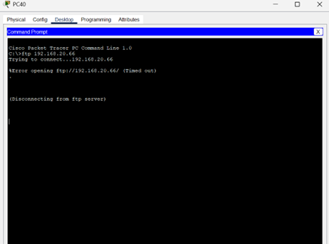

# London–Rotterdam WAN Simulation (Cisco Packet Tracer)

This project presents a complete Cisco Packet Tracer simulation of a Wide Area Network (WAN)
connecting two sites: **London** and **Rotterdam**.

The purpose of this project is to demonstrate practical networking skills including:
- IP addressing and **FLSM subnetting**
- **Dynamic routing using RIPv2**
- Configuration of core **network services** (FTP, HTTP, DNS, Email)
- Basic **security implementation** using Windows Firewall
- End-to-end **testing and verification** of connectivity and services

---

## Task 1 – Network Design, IP Addressing & Subnetting

The network is based on the address space **192.168.20.0/24** and is subnetted using
**Fixed Length Subnet Masking (FLSM)** to support **40 hosts per LAN**.

A subnet mask of **/26 (255.255.255.192)** is used, providing:
- 64 IP addresses per subnet
- 62 usable host addresses
- Sufficient capacity for the required number of hosts

The network consists of:
- One LAN at the London site
- One LAN at the Rotterdam site
- One WAN subnet connecting the two routers

---

## Task 2 – Dynamic Routing (RIPv2)

Dynamic routing is implemented using **RIPv2** on both routers.
RIPv2 enables automatic exchange of routing information between all three subnets,
ensuring full connectivity without the need for static routes.

RIPv2 was selected because:
- It supports classless routing
- It is simple to configure
- It is appropriate for small to medium-sized networks

---

## Task 3 – Network Services & Security

### Network Services
- **FTP Server** configured on the Rotterdam Server (credentials: cisco / cisco)
- **HTTP and DNS Services** hosted on the London Server
- DNS domain configured as **adventureworks.com**
- **Email Server** configured on the Rotterdam Server using the same domain

Email clients are configured on selected PCs and verified through successful
send and receive operations.

### Security Configuration
A **Windows Firewall rule** is implemented on the Rotterdam Server to:
- Block **outbound FTP traffic**
- Protocol: TCP
- Port: 21

This provides basic server-side security while allowing other services
(HTTP, DNS, Email) to operate normally.

---

## Task 4 – Testing & Verification

The network is fully tested to confirm correct configuration and functionality.

Testing includes:
- ICMP ping tests to verify basic connectivity
- TRACERT tests to verify correct routing paths
- HTTP testing using a web browser
- FTP authentication and file access testing
- Email send and receive testing

All tests confirm:
- Correct IP addressing
- Proper operation of RIPv2 routing
- Availability of configured services
- End-to-end connectivity between London and Rotterdam

---

## Evidence – Screenshots

### Network Topology

### Windows Firewall – FTP Block (Rotterdam Server)

### TRACERT Tests

### HTTP Test

### FTP Tests

### Email Tests (Receiving Side)

---

## Project Files
- **Vasile.pkt** – Cisco Packet Tracer project file
- **README.md** – Project documentation
- **PNG files** – Visual evidence of configuration and testing

---

## How to Open the Project
1. Download the `.pkt` file from this repository
2. Open **Cisco Packet Tracer**
3. Load the project file
4. Verify IP addressing, routing, services, and security configuration
5. Repeat the test procedures described above
